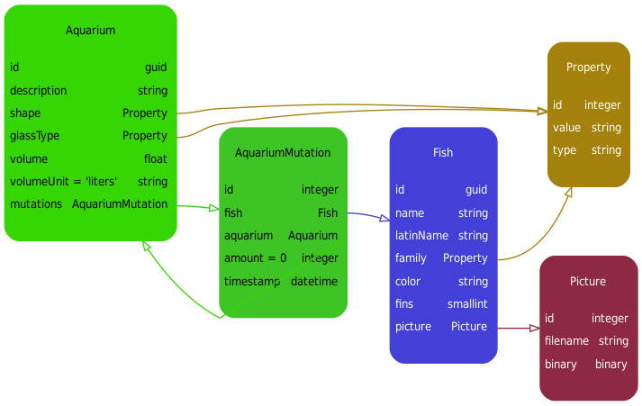

# Usabilla challange StockApp
By Sven Hagemann

# Requirements
* PHP 7.1
    * Tested on PHP 7.1.20 but should work fine on newer versions
* MySQL
    * Tested and build on 5.7.23, but any semi-recent version should be fine
    * Since all database interaction is done by Doctrine, should also work on other database platforms 

# How to setup?
* Pull this repo
* Run composer install
* Copy the .env.dist to .env
* Configure the .env file, all you need to do is set the DATABASE_URL
* Create database / schema and load demo data
    * bin/console doctrine:database:create
    * bin/console doctrine:database:create
    * bin/console doctrine:fixtures:load
* Make sure the var/ directory is writable by the webserver

# How to run tests?
* Copy the phpunit.xml.dist to phpunit.xml
* Edit the phpunit.xml and configure the DATABASE_URL parameter
    * If you want to use a seperate database for testing, please create a testing database using the steps described in the chapter "How to setup?"  
* Run bin/phpuit

# How to access?
Configure the public/ as your vHost root folder. Everything should be ready to go.

Make sure you have an internet connection, since the javascript libraries are being loaded from CDN's .

If their is trouble, you can debug by calling api.php/entity/list/fish and checking your webserver logs.

# Datamodel
